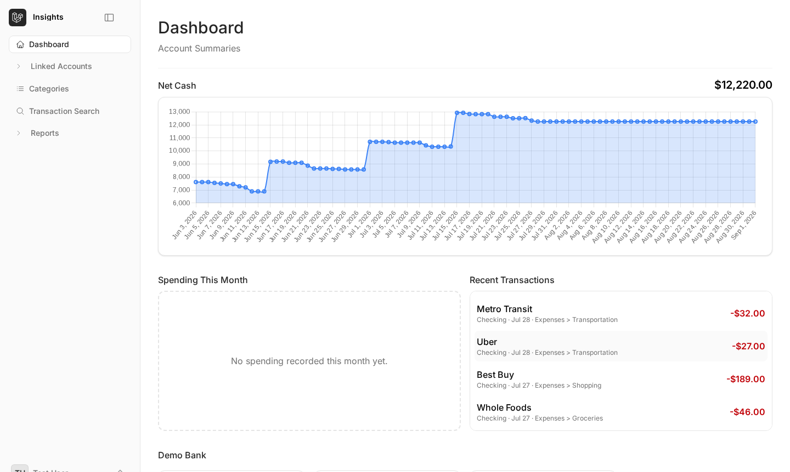
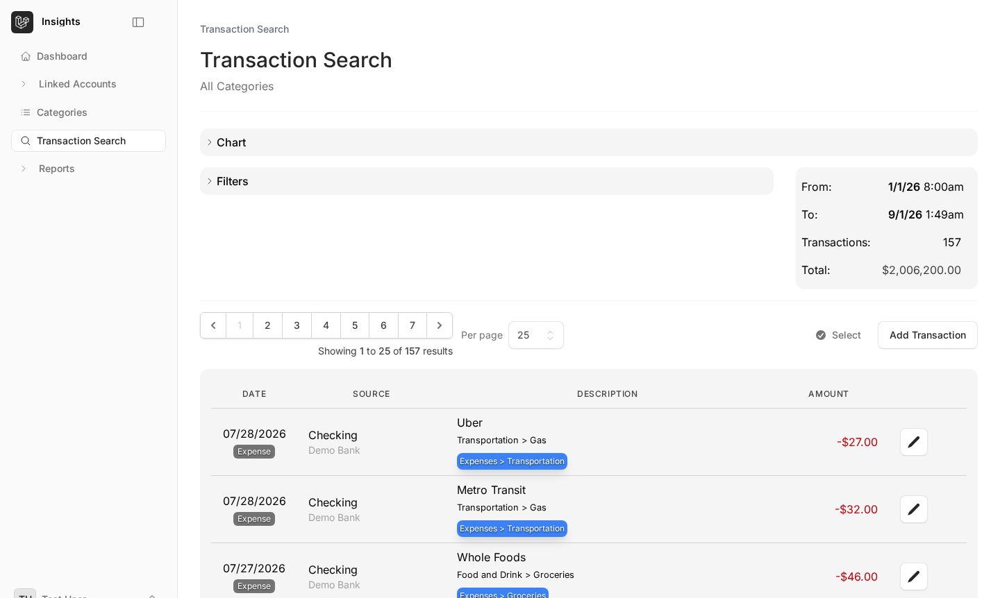
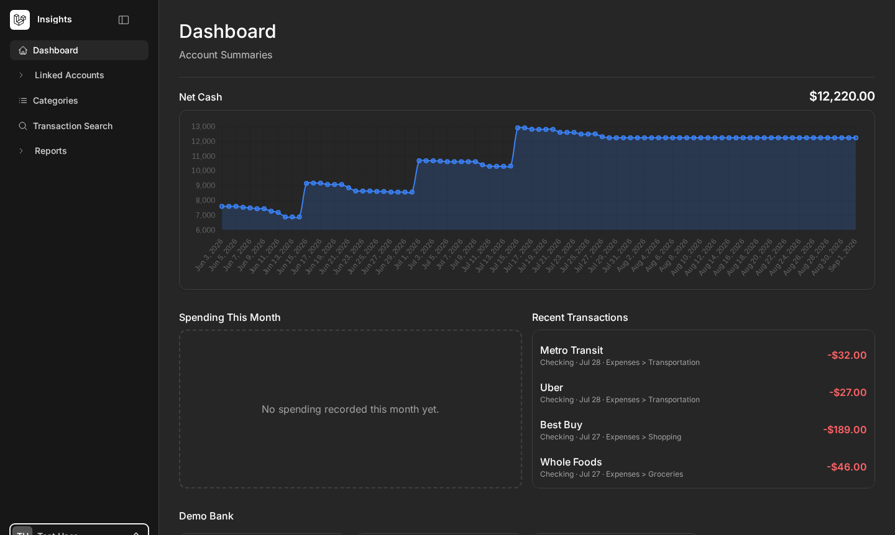
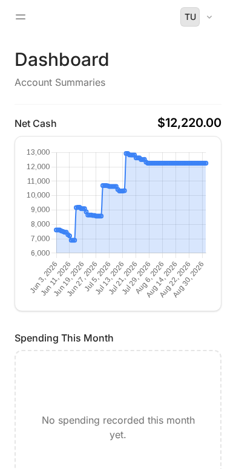

# Insights

[](https://github.com/loki495/insights/actions/workflows/ci.yml)
[](LICENSE)

A Laravel + Livewire application for aggregating and tracking personal financial data across
multiple bank accounts and credit cards using [Plaid](https://plaid.com/).

## Screenshots

| Dashboard | Transaction Search |
| --- | --- |
|  |  |

| Dark mode | Mobile |
| --- | --- |
|  |  |

All captured against the seeded demo dataset — see [Exploring without a Plaid
account](docs/SETUP.md#exploring-without-a-plaid-account).

## Status

Work in progress. Core functionality — account linking, transaction sync, categorization, type
classification, and reporting — is implemented. Autocategorization rules and budgeting tools are
not built yet — see [docs/ROADMAP.md](docs/ROADMAP.md) for what's planned.

## Features

- **Plaid integration** — link bank/credit accounts via Plaid Link, sync transactions, and mirror
  Plaid's own category taxonomy (`OriginalCategory`, including its `personal_finance_category`
  metadata) alongside your own custom categories.
- **Hierarchical, user-defined categories** — nested categories independent of Plaid's own tree,
  with color coding and a searchable picker.
- **Transaction type classification** — every transaction is tagged `income`, `expense`,
  `transfer`, or `adjustment`, derived automatically from Plaid's category data at sync time (e.g.
  credit card payments are classified as transfers, not expenses, avoiding double-counting).
  Transfers are automatically paired across accounts (opposite sign, similar amount, close dates);
  pairing can also be searched/set/cleared manually from a quick-edit popup on any transaction.
- **Account tracking modes** — mark an account `tracked` (included in aggregate reports),
  `reference` (visible but excluded from totals), or `excluded`. Unlinking an institution soft-closes
  it (reversible) instead of deleting its accounts/transaction history.
- **Dashboard** — a trailing-90-day net cash trend, a "Spending This Month" category breakdown,
  and a recent-transactions feed, alongside per-account balance cards grouped by institution.
- **Reports**, both with configurable date range and granularity (daily/monthly/quarterly/yearly):
  - **Balance / Net Cash** — asset vs. liability snapshot and a net-cash trend chart.
  - **Income / Expense** — income/expense/net snapshot, a trend chart (grouped bars, or a stacked
    area breakdown when filtering to specific categories), and a paginated list of the underlying
    transactions. Filterable by category (multi-select), a simple text search, and an amount range.
- **Transaction Search** — the full transaction list/search view (also embedded per-account),
  filterable by account, category, type, amount range, and date range, with a richer search syntax
  (every word must match — prefix with `-` to exclude instead) and a category-breakdown chart.
- **Bulk actions** — select multiple transactions to assign a category/type or delete at once.
- **Optimistic UI** — category/type edits show instantly and reconcile with the server response.
- Mobile-responsive layout and dark mode throughout.

## Major implementation decisions

- **Transaction type is derived automatically at sync time, not left to the user.**
  Every transaction is classified `income`/`expense`/`transfer`/`adjustment` straight from
  Plaid's own category data — e.g. a credit card payment is a `transfer`, not an `expense`,
  which avoids double-counting money that's just moving between your own accounts.
  Transfers are then auto-paired across accounts (opposite sign, similar amount, close
  dates), with manual override available from a quick-edit popup for the cases the
  heuristic gets wrong.
- **Hierarchical categories are independent of Plaid's own taxonomy**, not built on top
  of it. Plaid's `OriginalCategory`/`personal_finance_category` is preserved alongside
  your own nested categories rather than merged into them — the two systems can diverge
  freely, e.g. renaming or restructuring your own categories never touches what Plaid
  reported.
- **Account tracking is three states, not a boolean.** `tracked` (in aggregate reports),
  `reference` (visible, excluded from totals), or `excluded` — a plain "hide this account"
  toggle can't distinguish "I want to see this account's balance but not have it skew my
  net worth" from "I never want to see this again," so it isn't one.
- **Unlinking an institution soft-closes it instead of deleting anything.** Accounts and
  transaction history stay intact and reversible; only a hard delete (if ever added) would
  actually remove data.

## Tech Stack

- PHP 8.3+ / Laravel 13
- Livewire 4 / Volt (single-file components)
- Flux UI (free tier)
- Tailwind CSS 4
- Chart.js
- Plaid API
- SQLite (default) or MySQL via `DB_CONNECTION` — both are exercised in CI (see
  `.github/workflows/ci.yml`'s `test`/`test-mysql` jobs). Postgres should work (Laravel supports
  it natively) but isn't CI-tested yet, so treat it as unverified.
- Pest (tests), Pint (style), Larastan/PHPStan (static analysis), Rector

## Quick Start

These steps build the real production image (`docker/Dockerfile.prod`) — the same setup you'd
actually run this for real personal use with, not a dev/hot-reload build. No Plaid account needed
to try it out (see below); you'll only need one once you're ready to link a real bank account —
see [Linking a bank account](docs/SETUP.md#linking-a-bank-account).

```bash
git clone <this-repo> insights && cd insights
cp .env.example .env
```

Edit `.env` and set `APP_ENV=production` and `APP_DEBUG=false`. Everything else can stay at its
default for a local trial (`APP_URL` only matters once you're deploying somewhere real — see
[Production deployment](docs/SETUP.md#production-deployment) for that, and for Plaid credentials).

```bash
docker compose -f docker-compose.prod.yml build
docker compose -f docker-compose.prod.yml run --rm app php artisan key:generate --show
# paste the output into .env's APP_KEY=, then:
docker compose -f docker-compose.prod.yml up -d --wait  # waits for migrations to finish
docker compose -f docker-compose.prod.yml exec app php artisan db:seed --class=DemoDataSeeder --force
```

The app is now at **http://localhost:8000**, seeded with a `test@example.com` / `password` login
and realistic sample data — see [Exploring without a Plaid
account](docs/SETUP.md#exploring-without-a-plaid-account) for details.

Want to develop/contribute instead? See [docs/SETUP.md](docs/SETUP.md) for the local-development
setup (hot-reloading, debug output) as well as bare-metal install options and running behind your
own reverse proxy.

## Testing

```bash
composer test   # Rector (dry-run) -> Pint -> peck -> PHPStan -> Pest (unit + browser)
```

Runs against both SQLite and MySQL in CI. Coverage floor is 95% (currently ~95.9%) — see
[CONTRIBUTING.md](CONTRIBUTING.md#before-opening-a-pr) for the full breakdown, including
the Pest browser-test setup.

## Current limitations

- No autocategorization rules or budgeting tools yet — see [docs/ROADMAP.md](docs/ROADMAP.md).
- Postgres isn't CI-tested (SQLite and MySQL are) — it should work, since Laravel supports
  it natively, but treat it as unverified until it's actually exercised in CI.
- Single-user per install — there's no multi-tenant account model; each deployment is one
  person's own finances.
- Plaid-only — no manual/CSV-imported accounts yet for banks Plaid doesn't cover.

## Contributing

Want to run the test suite, work on a fix, or open a PR? See [CONTRIBUTING.md](CONTRIBUTING.md).

## Notes

This project is actively evolving; some routes and UI components may still change.

## License

Licensed under [AGPL-3.0](LICENSE). In short: you're free to use, modify, and self-host this —
including commercially — but if you distribute a modified version or run it as a network service,
you have to make that version's source available under the same license too. Genuinely separate
add-ons that merely integrate with this app (not modifications to it) aren't required to be
AGPL — see [CONTRIBUTING.md](CONTRIBUTING.md) if you're contributing.
