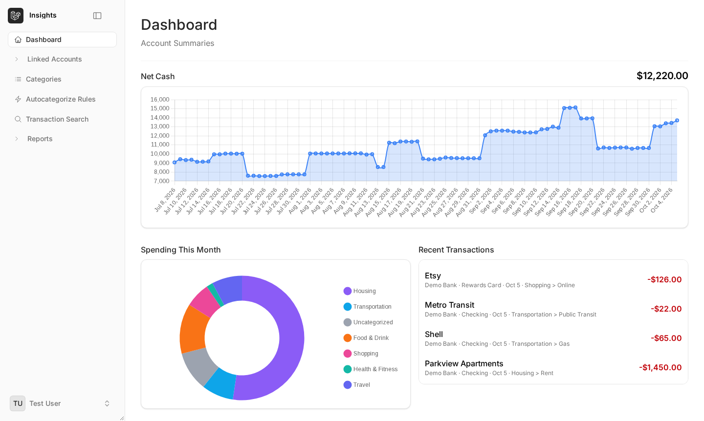
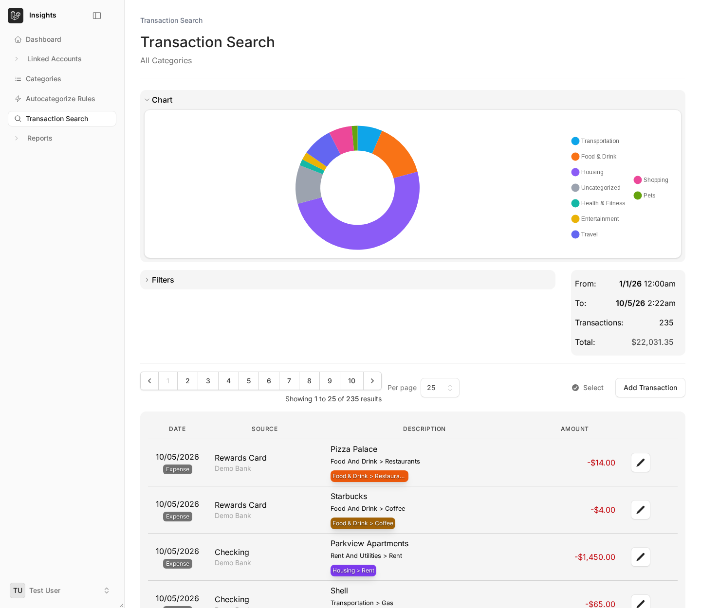
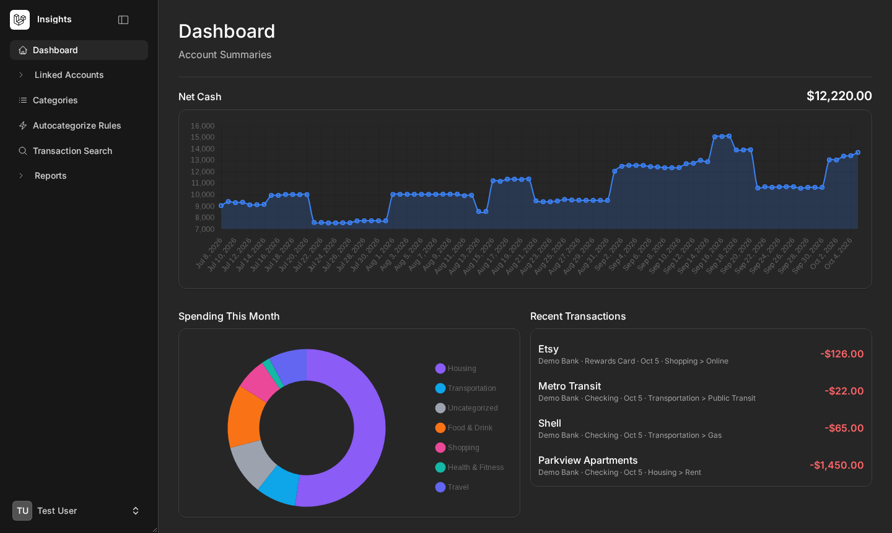
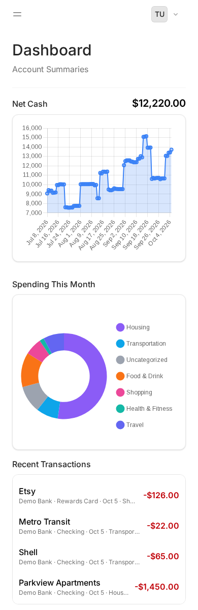
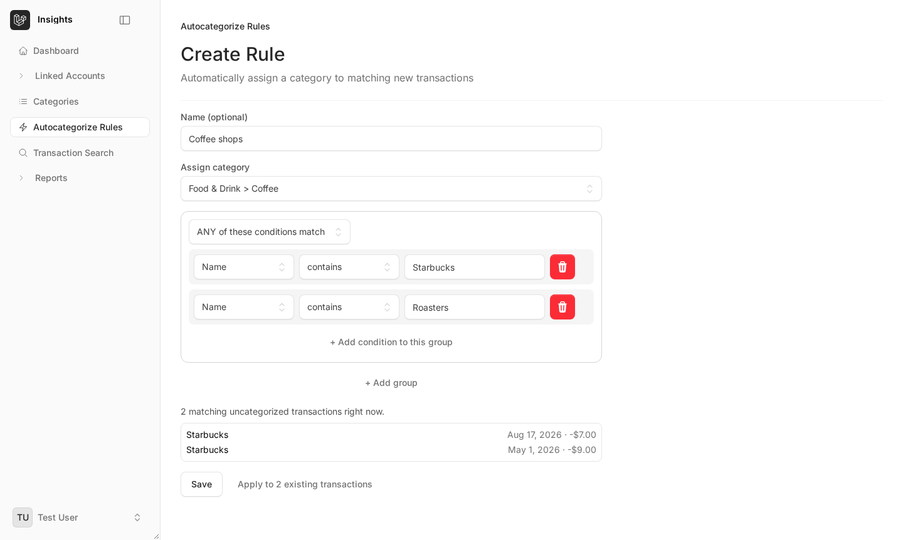

# Insights

[](https://github.com/loki495/insights/actions/workflows/ci.yml)
[](https://codecov.io/gh/loki495/insights)
[](LICENSE)

A Laravel + Livewire application for aggregating and tracking personal financial data across
multiple bank accounts and credit cards using [Plaid](https://plaid.com/).

**Live demo:** [insights-demo.ac495.net](https://insights-demo.ac495.net) (sample data, sign in
with `test@example.com` / `password`; each visitor gets their own copy, reset daily).

## Screenshots

| Dashboard | Transaction Search |
| --- | --- |
|  |  |

| Dark mode | Mobile |
| --- | --- |
|  |  |

| Autocategorize rules |
| --- |
|  |

All captured against the seeded demo dataset — see [Exploring without a Plaid
account](docs/SETUP.md#exploring-without-a-plaid-account).

## Status

Public beta for early user feedback, not mature financial software. Try the sample dataset
before connecting real accounts, and keep backups of any data you want to retain. Linking real
banks needs your own Plaid developer account, and Plaid must approve it for production access
before it returns real institutions. Core functionality (account linking, transaction sync,
categorization, type classification, autocategorize rules, and reporting) is implemented. Budgeting tools are not
built yet — see [docs/ROADMAP.md](docs/ROADMAP.md) for what's planned.

## Features

- **Plaid integration** — link bank/credit accounts via Plaid Link, sync transactions, and mirror
  Plaid's own category taxonomy (`OriginalCategory`, including its `personal_finance_category`
  metadata) alongside your own custom categories.
- **Hierarchical, user-defined categories** — nested categories independent of Plaid's own tree,
  with color coding and a searchable picker.
- **Autocategorize rules** — per-user rules that automatically assign a category to new
  transactions based on merchant/name, amount, account, or date conditions, combinable via one
  level of AND/OR groups (e.g. "(merchant contains Starbucks and amount < $10) or amount > $1,000").
  A rule never overwrites a manual categorization, and only ever applies to a transaction that
  doesn't already have one. The rule editor shows a live list of exactly which existing
  uncategorized transactions the current rule matches, plus a button to apply it to them
  retroactively right away.
- **Transaction type classification** — every transaction is tagged `income`, `expense`,
  `transfer`, or `adjustment`, derived automatically from Plaid's category data at sync time (e.g.
  credit card payments are classified as transfers, not expenses, avoiding double-counting).
  Transfers are automatically paired across accounts (opposite sign, similar amount, close dates);
  pairing can also be searched/set/cleared manually from a quick-edit popup on any transaction.
- **Manual transaction entry** — add or edit an individual transaction by hand on any existing
  account, for anything Plaid doesn't capture (cash, a correction, a one-off) — see "Current
  limitations" below for what this doesn't cover (a whole manual/CSV-imported account).
- **Account tracking modes** — mark an account `tracked` (included in aggregate reports),
  `reference` (visible but excluded from totals), or `excluded`. Unlinking an institution soft-closes
  it (reversible) instead of deleting its accounts/transaction history.
- **Dashboard** — a trailing-90-day net cash trend, a "Spending This Month" category breakdown,
  and a recent-transactions feed, alongside per-account balance cards grouped by institution.
- **Reports**, both with configurable date range and granularity (daily/monthly/quarterly/yearly):
  - **Balance / Net Cash** — asset vs. liability snapshot and a net-cash trend chart.
  - **Income / Expense** — income/expense/net snapshot, a trend chart (grouped bars, or a stacked
    area breakdown when filtering to specific categories), and a paginated list of the underlying
    transactions. Filterable by category (multi-select), a simple text search, and an amount range.
- **Transaction Search** — the full transaction list/search view (also embedded per-account),
  filterable by account, category, type, amount range, and date range, with a richer search syntax
  (every word must match — prefix with `-` to exclude instead) and a category-breakdown chart.
- **Bulk actions** — select multiple transactions to assign a category/type or delete at once.
- **Optimistic UI** — category/type edits show instantly and reconcile with the server response.
- Mobile-responsive layout and dark mode throughout.

## Major implementation decisions

- **Transaction type is derived automatically at sync time, not left to the user.**
  Every transaction is classified `income`/`expense`/`transfer`/`adjustment` straight from
  Plaid's own category data — e.g. a credit card payment is a `transfer`, not an `expense`,
  which avoids double-counting money that's just moving between your own accounts.
  Transfers are then auto-paired across accounts (opposite sign, similar amount, close
  dates), with manual override available from a quick-edit popup for the cases the
  heuristic gets wrong.
- **Hierarchical categories are independent of Plaid's own taxonomy**, not built on top
  of it. Plaid's `OriginalCategory`/`personal_finance_category` is preserved alongside
  your own nested categories rather than merged into them — the two systems can diverge
  freely, e.g. renaming or restructuring your own categories never touches what Plaid
  reported.
- **Account tracking is three states, not a boolean.** `tracked` (in aggregate reports),
  `reference` (visible, excluded from totals), or `excluded` — a plain "hide this account"
  toggle can't distinguish "I want to see this account's balance but not have it skew my
  net worth" from "I never want to see this again," so it isn't one.
- **Unlinking an institution soft-closes it instead of deleting anything.** Accounts and
  transaction history stay intact and reversible; only a hard delete (if ever added) would
  actually remove data.

## Tech Stack

- PHP 8.5+ / Laravel 13
- Livewire 4 / Volt (single-file components)
- Flux UI (free tier)
- Tailwind CSS 4
- Chart.js
- Plaid API
- SQLite (default) or MySQL via `DB_CONNECTION` — both are exercised in CI (see
  `.github/workflows/ci.yml`'s `test`/`test-mysql` jobs). Postgres should work (Laravel supports
  it natively) but isn't CI-tested yet, so treat it as unverified.
- Pest (tests), Pint (style), Larastan/PHPStan (static analysis), Rector

## Quick Start

These steps build the real production image (`docker/Dockerfile.prod`) — the same setup you'd
actually run this for real personal use with, not a dev/hot-reload build. No Plaid account needed
to try it out (see below); you'll only need one once you're ready to link a real bank account —
see [Linking a bank account](docs/SETUP.md#linking-a-bank-account).

```bash
git clone https://github.com/loki495/insights.git insights && cd insights
cp .env.example .env
```

Edit `.env` and set `APP_ENV=production` and `APP_DEBUG=false`. Everything else can stay at its
default for a local trial (`APP_URL` only matters once you're deploying somewhere real — see
[Production deployment](docs/SETUP.md#production-deployment) for that, and for Plaid credentials).

```bash
docker compose -f docker-compose.prod.yml build
docker compose -f docker-compose.prod.yml run --rm --entrypoint "" app php artisan key:generate --show
# paste the output into .env's APP_KEY=, then:
docker compose -f docker-compose.prod.yml up -d --wait  # waits for migrations to finish
docker compose -f docker-compose.prod.yml exec app php artisan db:seed --class=DemoDataSeeder --force
```

The app is now at **http://localhost:8000**, seeded with a `test@example.com` / `password` login
and realistic sample data — see [Exploring without a Plaid
account](docs/SETUP.md#exploring-without-a-plaid-account) for details.

Want to develop/contribute instead? See [docs/SETUP.md](docs/SETUP.md) for the local-development
setup (hot-reloading, debug output) as well as bare-metal install options and running behind your
own reverse proxy.

## Feedback

Start with the [sample-data quick start](#quick-start); no bank connection is needed.
Please [open an issue](https://github.com/loki495/insights/issues) with your version or commit,
installation method, expected behavior, actual behavior, and steps to reproduce. The most useful
early feedback is where setup becomes unclear, whether categorization and transfer matching make
sense, and which reports help you understand the sample data.

Use sample transactions in screenshots. Never include bank data, access tokens, `.env`, or a
database backup; report suspected vulnerabilities through [SECURITY.md](SECURITY.md).
See [backup and upgrades](docs/SETUP.md#backup-restore-and-upgrades) before using real data.

## Testing

```bash
composer test   # Rector (dry-run) -> Pint -> peck -> PHPStan -> Pest (unit + browser)
```

Runs against both SQLite and MySQL in CI. Coverage floor is 95% (the badge above shows today's figure); see
[CONTRIBUTING.md](CONTRIBUTING.md#before-opening-a-pr) for the full breakdown, including
the Pest browser-test setup.

## Owner auto-login (optional)

Off by default. On a single-owner deployment you can skip the login page from your own network
with two `.env` settings:

| Variable | Effect |
|---|---|
| `AUTO_LOGIN_EMAIL` | An existing account to sign in as. It is never created. In demo mode it defaults to the demo account. |
| `AUTO_LOGIN_LAN=true` | Signs that account in for requests that carry no Cloudflare edge header (`CF-Connecting-IP`/`CF-Ray`) and come from a private address. |

This trusts the network path, not a credential: **everyone who can reach the app from a private
address is treated as you.** Before enabling it:

- **Nothing but your LAN and your tunnel may reach the app.** No public port-forward, and no
  `APP_BIND_ADDRESS` reachable from outside.
- **A request that came through Cloudflare is never auto-logged-in**, Cloudflare Access included.
  Those headers can be forged by anyone who reaches the app directly, so it uses the normal login.
- **The address checked is Laravel's client IP:** the direct peer, unless that peer is listed in
  `TRUSTED_PROXIES`, in which case it's the address that proxy put in `X-Forwarded-For`.
- **Behind a reverse proxy (Traefik, nginx, Caddy), set `TRUSTED_PROXIES` to it.** Left blank,
  every request through the proxy arrives from its private Docker address and counts as LAN,
  whoever sent it.
- **List only private or loopback addresses in `TRUSTED_PROXIES`.** An entry reaching public space
  (`*`, `0.0.0.0/0`, a public range) would let a client claim a LAN address, so the app turns
  auto-login off when it sees one.

Apply a change with `docker compose up -d`; a plain image pull keeps the old environment. See
`AutoLoginForTrustedRequests`.

## Current limitations

- No budgeting tools yet — see [docs/ROADMAP.md](docs/ROADMAP.md).
- Postgres isn't CI-tested (SQLite and MySQL are) — it should work, since Laravel supports
  it natively, but treat it as unverified until it's actually exercised in CI.
- Single-user per install — there's no multi-tenant account model; each deployment is one
  person's own finances.
- Plaid-only — no manual/CSV-imported accounts yet for banks Plaid doesn't cover.

## Contributing

Want to run the test suite, work on a fix, or open a PR? See [CONTRIBUTING.md](CONTRIBUTING.md).

## Notes

This project is actively evolving; some routes and UI components may still change.

## License

Licensed under [AGPL-3.0-or-later](LICENSE). In short: you're free to use, modify, and self-host
this — including commercially — but if you distribute a modified version or run it as a network
service, you have to make that version's source available under the same license too, with no
carve-out for add-ons or integrations. See [CONTRIBUTING.md](CONTRIBUTING.md) if you're
contributing.
